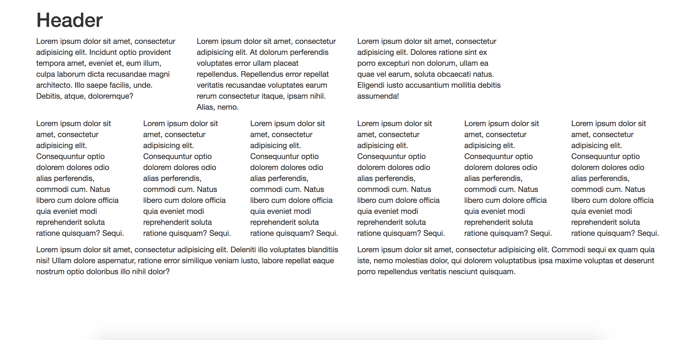

# Bootstrap Text Layout

In this activity, I used Bootstrap to implement a grid system.

## Instructions

* Open [Unsolved/index.html](Unsolved/index.html).

* Using Bootstrap, I created the layout in the following image: 

  

  * In the `<body>`, createed a `
` with a `"container"` class.

  * Started creating rows and columns.

  * Used `Lorem ipsum` for dummy text.

## Extras

* Prior to coding, I spent some time drawing the grid layout.

* You may have refered to the [Bootstrap grid system documentation](https://getbootstrap.com/docs/4.0/layout/grid/).